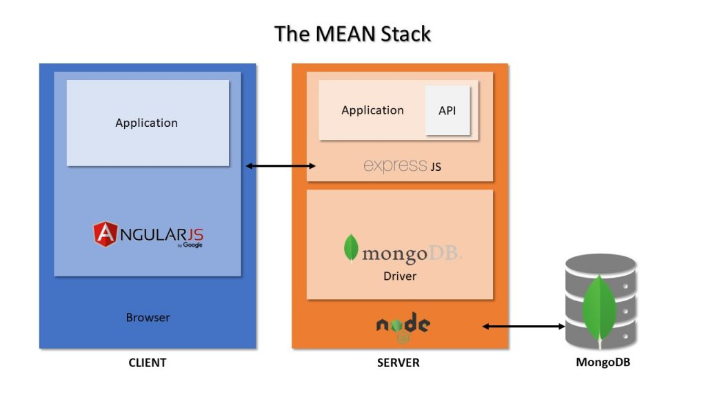

# MEAN-Stack

MEAN stack is an open-source JavaScript software stack. MEAN is an acronym for the JavaScript-based technologies used in MEAN stack development. M is for MongoDB, E is for Express JS, A is for AngularJS, and N is for Node.js. These four powerhouse technologies come together to create a full-stack javascript framework used to simply and quickly develop web applications.
Cluster Verification

Installation
------
* Download or clone the repository. 
* Run `npm install` command then run `npm start` command.
* Open browser with URL as http://localhost:8080/

